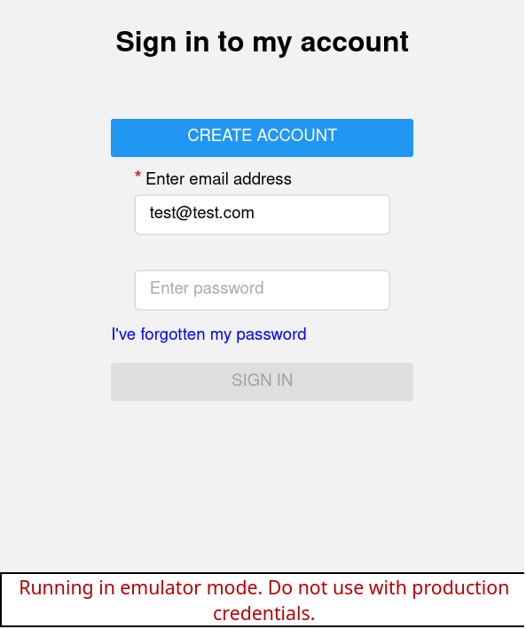

# React Native Firebase Authentication template

## About

Based on a [tutorial](https://www.atomlab.dev/tutorials/email-authentication-react-native-firebase), but changes a few things:

* Auth components are split into individual react components
* Cypress end to end tests
* React Native router
* Typescript

The idea was to create a repository that can be forked and used to build projects that require a basic auth Firebase integration.

### Images

Various screens:

Running cypress tests:

## How to use

* Fork this repository
* Enter Firebase project id in `.firebaserc`
* Enter details of the Firebase project into `config/firebase.js`
* Setup [local firebase environment](https://firebase.google.com/docs/emulator-suite/install_and_configure)
* **IMPORTANT** When using with a real project with a database, please make sure [to secure your firestore](https://firebase.google.com/docs/firestore/security/rules-structure).

## How to start

Start react native app

`npm start`

Start local firebase environment

`firebase emulators:start`

## Testing

**!!IMPORTANT!!** Please do not run against production, user database is cleared before each test!

Start cypress tests via ui
`npx cypress open`

Or via cli
`npx cypress run --spec "cypress/e2e/auth"`

There is also a simple shell script to run an "endurance test", which can be triggered and runs all feature files:
`sh tools/cypress-endurance-test.sh <number of iterations>`

Which will produce output similar to this:

    $sh tools/cypress-endurance-tess.sh 5
    All specs passed!: x5 times
    Runtime: 0 hours 1 minutes 55 seconds
